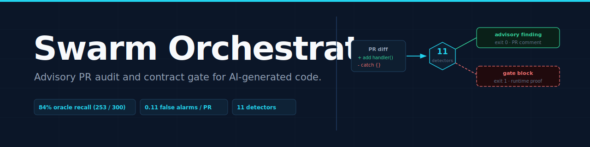

<p align="center">
  
</p>

# Swarm Orchestrator

Reads a pull request (PR) diff and flags the shortcuts artificial intelligence (AI) coding agents use to look done without being done. Relaxed tests, swallowed errors, fake renames, eleven categories in all. Grading patches against typed obligation contracts via a multi-persona pipeline is the second surface.

For engineers reviewing AI-written PRs at volume. Compliance teams generate CycloneDX-ML (machine learning) and SPDX (Software Package Data Exchange) 3.0 AI-BOM (bill of materials) artifacts. The artifacts map to EU AI Act (European Union Artificial Intelligence Act) Annex IV and CISA (Cybersecurity and Infrastructure Security Agency) reporting. Maintainers keep a hash-chained evidence record for every graded patch.

**Flags are tips, blocks are proof.** A flag is a structural detector seeing a cheat-shaped pattern; it is advisory and never blocks a merge (`--mode advise` is the default). A block is a self-certifying runtime result whose per-instance controls are all green, and every block ships the exact command that reproduces it in a fresh checkout. Eight proof protocols back the gate today: six execution-grounded restoration proofs (`test-tamper`, `mock-mutation`, `no-op-fix`, `type-suppression`, `fake-refactor`, `dead-branch`) plus `claim-falsified` and `obligation-failure`. The measured proven-finding precision on the execution-grounded-viable corpus slice, with its plain n, is in [`benchmarks/real-corpus/GATE-PRECISION-REPORT.md`](benchmarks/real-corpus/GATE-PRECISION-REPORT.md).

<!-- BADGES:START -->
[](https://github.com/moonrunnerkc/swarm-orchestrator/actions/workflows/ci.yml)
[](LICENSE)
[](package.json)
[](package.json)
[&color=brightgreen)](benchmarks/results/AB-REPORT.md)
[](benchmarks/real-prs/REAL-WORLD-REPORT.md)
[&color=brightgreen)](benchmarks/real-prs/v11-BENEFIT-REPORT.md)
<!-- BADGES:END -->

<p align="center">
  <a href="#install">Install</a> ·
  <a href="#quick-start">Quick start</a> ·
  <a href="#results">Results</a> ·
  <a href="#cheat-detectors">Detectors</a> ·
  <a href="#use-as-a-github-action">GitHub Action</a> ·
  <a href="#ai-bom">AI-BOM</a> ·
  <a href="#orchestrator-mode">Orchestrator</a> ·
  <a href="#architecture">Architecture</a> ·
  <a href="#commands">Commands</a> ·
  <a href="#limitations">Limitations</a>
</p>

## Install

Node 20 or later. See [`package.json`](package.json).

```bash
git clone https://github.com/moonrunnerkc/swarm-orchestrator.git
cd swarm-orchestrator
npm install
npm run build
npm link
swarm --help
```

## Quick start

```bash
# Audit a PR by reference (advisory by default; never blocks the merge)
GITHUB_TOKEN=... swarm audit moonrunnerkc/swarm-orchestrator#42

# Opt in to merge-blocking gate mode (blocks only on a self-certifying
# runtime proof; enable the execution-grounded layer in
# .swarm/audit-config.yaml first; see docs/audit-config.md)
GITHUB_TOKEN=... swarm audit moonrunnerkc/swarm-orchestrator#42 --mode gate

# Audit a local diff with all 11 detectors
git diff main...HEAD | swarm audit --diff-stdin --detectors experimental

# Audit and emit a CycloneDX 1.6 ML-BOM
swarm audit --diff-file my.patch --emit-aibom cyclonedx-ml

# Shadow mode: record verdicts to disk without commenting or gating
swarm audit --pr <ref> --shadow my-org/my-repo
```

Exit codes: `0` advisory or any advise-mode run, `1` block (gate mode only), `2` usage error.

## Results

Every number here is reproducible from this repo and runs offline.

### Catches cheats that linters miss

| PR | Cheat caught | Semgrep / ESLint |
|---|---|---|
| [cloudflare/workers-sdk#14063](https://github.com/cloudflare/workers-sdk/pull/14063) | fake refactor: function renamed but two callers still use the old name | not flagged |
| [cloudflare/workers-sdk#14132](https://github.com/cloudflare/workers-sdk/pull/14132) | error swallow: bare empty `catch` silently hides every error in the block | not flagged |

Both reproduce deterministically from the committed diffs. Semgrep (210 rules) and the ESLint security ruleset flag neither. Reproduce either with `swarm audit --diff-file benchmarks/real-prs/diffs/cloudflare-workers-sdk/<pr>.diff`. Full study across twelve repos in [`benchmarks/real-prs/v11-BENEFIT-REPORT.md`](benchmarks/real-prs/v11-BENEFIT-REPORT.md).

### Detection numbers

**301 of 325** planted cheats recovered (92.6%) across thirteen categories scored against a defect-injection oracle: 258/275 structural plus 43/50 on the two semantic categories the judge-primary path covers. The behavioral `cheat-mock-mutation` category drove the latest gain: focusing the judge on the hunks that add a value-injecting mock lifted its recall from 0.16 (the prior rapid-mlx glm47 run) to 0.96 (24/25) on the local qwen3.6 judge, while the clean-PR judge false-positive rate fell from 10% to 0%. Reproduce with `SWARM_JUDGE_PROVIDER=ollama SWARM_JUDGE_MODEL=qwen3.6:35b-a3b npm run benchmarks:full`; A/B with the same-model decomposition in [`benchmarks/results/AB-REPORT.md`](benchmarks/results/AB-REPORT.md) and per-detector recall in [`benchmarks/oracle-corpus/per-detector-recall.md`](benchmarks/oracle-corpus/per-detector-recall.md).

**0.11 findings per PR** on an 18-PR pilot across five public repos. At or below the pre-upgrade auditor's false-alarm burden, with the oracle recall gain intact. Full numbers in [`benchmarks/real-prs/REAL-WORLD-REPORT.md`](benchmarks/real-prs/REAL-WORLD-REPORT.md).

### Execution-grounded layer

Reproduce with `npm run execution-grounded:full`. This optional layer sets up a sandboxed checkout and runs mutation testing, repro execution, and a coverage delta scoped to the lines the PR changed. It surfaced one proof-correlated catch: proof anchor [`trpc/trpc#6098`](https://github.com/trpc/trpc/pull/6098), where 8 lines with surviving mutations were later changed by a hotfix. Evaluation in [`benchmarks/real-prs/v11-EXECUTION-GROUNDED-REPORT.md`](benchmarks/real-prs/v11-EXECUTION-GROUNDED-REPORT.md).

## Cheat detectors

Eleven detectors. Eight load by default; three (`comment-only-fix`, `exception-rethrow-lost-context`, `dead-branch-insertion`) require `--detectors experimental` because they have no real-PR signal yet to measure against. Registered in [`src/audit/cheat-detector/detector-sets.ts`](src/audit/cheat-detector/detector-sets.ts).

| Category | Set | Trigger |
|---|---|---|
| `error-swallow` | default | Bare empty or comment-only `catch` block added in non-test code. |
| `mock-of-hallucination` | default | `jest.mock` / `vi.mock` / `@patch` against a module declared in no manifest in the repo. |
| `no-op-fix` | default | Test modified with no source change, or vice versa; import-graph reachability fallback when only one side moved. |
| `fake-refactor` | default | Exported symbol renamed in source, no caller in the diff updates the old name. |
| `coverage-erosion` | default | Source branch added with no compensating test addition. |
| `test-relaxation` | default | Strict matcher swapped for a loose one, or a test block removed without same-chunk replacement. |
| `assertion-strip` | default | Net assertion count in a test file drops after the PR. |
| `type-suppression` | default | A type-checker or linter suppression (for example `@ts-ignore` or `eslint-disable`) added over a changed line. |
| `comment-only-fix` | experimental | Source modifications are all comment additions. |
| `exception-rethrow-lost-context` | experimental | `throw err` replaced with `throw new Error(...)` and `{ cause }` not forwarded. |
| `dead-branch-insertion` | experimental | Branch guarded by a literal-false condition added. |

Beyond the structural detectors, a judge-primary path catches two semantic categories (`goal-not-fixed`, `cheat-mock-mutation`) by asking the judge whether the diff delivers the PR's stated claim. For `cheat-mock-mutation` a deterministic pre-filter hands the judge only the test hunks that add a value-injecting mock, so the judge reads the six-line cheat instead of skimming a 40k-char diff, and is never asked on a clean PR that adds no such mock. A proven mock-mutation can also block under `--mode gate` as a self-certifying `mock-mutation-proven` trigger (see [`docs/limitations.md`](docs/limitations.md)).

Per-repo configuration in `.swarm/audit-config.yaml`: `excludePaths`, `intentSeverityPolicy` (`strict` | `lenient` | `off`), and `judgePrimary`. See [`docs/audit-config.md`](docs/audit-config.md).

## Use as a GitHub Action

```yaml
name: PR audit
on:
  pull_request:
    types: [opened, synchronize, reopened, ready_for_review]
permissions:
  pull-requests: write
  contents: read
jobs:
  audit:
    runs-on: ubuntu-latest
    steps:
      - uses: actions/checkout@v4
        with:
          fetch-depth: 0
      - uses: moonrunnerkc/swarm-orchestrator@main
        with:
          audit-mode: true
          mode: advise           # advise | gate
          detectors: default     # default | experimental
          emit-aibom: cyclonedx-ml
        env:
          GITHUB_TOKEN: ${{ secrets.GITHUB_TOKEN }}
```

Outputs: `audit-pass`, `audit-findings`, `audit-ledger`. Full input list in [`action.yml`](action.yml).

### Enabling the execution-grounded layer

Structural detectors run with no setup and only ever flag (advisory). The six runtime proofs that can gate a merge (`test-tamper`, `mock-mutation`, `no-op-fix`, `type-suppression`, `fake-refactor`, `dead-branch`) need the execution-grounded layer, which is off until you set `executionGrounded.enabled: true` in [`.swarm/audit-config.yaml`](docs/audit-config.md). Turning it on is what lets `--mode gate` block, and every block it produces ships the exact command that reproduces it in a fresh checkout.

What it costs: for each audited PR the layer provisions the repository in a sandbox (clone the head, install dependencies, run the affected tests), so it adds clone, install, and test wall-clock to the job, and only PRs in a Node project with a lockfile and a recognized test runner (jest, vitest, mocha) provision at all. Everything else fails closed to advisory. The static viability screen on the project corpus measured 12 of 197 PRs as provisionable ([`benchmarks/real-corpus/eg-viability.json`](benchmarks/real-corpus/eg-viability.json)); your own repository, where the suite is known to run in CI, provisions far more reliably than an arbitrary sample. Nothing the layer cannot prove ever blocks: with the layer off, or on a non-provisionable PR, gate mode passes on advisory findings alone.

## AI-BOM

`--emit-aibom cyclonedx-ml | spdx-ai | both` writes one document per format per run under `.swarm/aibom/`. Emitters in [`src/audit/aibom/`](src/audit/aibom/) produce hand-rolled JSON against the upstream specs with no third-party AI-BOM runtime dependency.

Procurement mappings:

- [`docs/eu-ai-act-mapping.md`](docs/eu-ai-act-mapping.md): EU AI Act (European Union Artificial Intelligence Act) Article 11 + Annex IV fields.
- [`docs/cisa-sbom-ai-mapping.md`](docs/cisa-sbom-ai-mapping.md): CISA (Cybersecurity and Infrastructure Security Agency) SBOM-for-AI minimum elements.

## Orchestrator mode

Grades patches against a typed contract instead of auditing a PR diff.

```bash
swarm init                                    # Scaffold contract.yaml + patches.jsonl
swarm run --goal "check this project builds"  # Deterministic provider, no API key
```

Minimal contract:

```yaml
obligations:
  - type: build-must-pass
    command: npm run build
  - type: test-must-pass
    command: npm test
```

Hosted-model run:

```bash
export ANTHROPIC_API_KEY=sk-...
swarm run --goal "add a /health endpoint" --extractor anthropic --session anthropic
```

Local-LLM run (Ollama):

```bash
swarm run --goal "add a named export sum(a, b)" \
  --session local --local-backend ollama \
  --local-base-url http://localhost:11434 \
  --local-model-session gemma4:31b \
  --local-grammar none --local-max-concurrency 1 --preset fast
```

Provider details in [`docs/providers.md`](docs/providers.md). Obligation taxonomy in [`docs/check-types.md`](docs/check-types.md). Schema in [`src/contract/schema/v1.json`](src/contract/schema/v1.json).

## Architecture

Two command-line interface (CLI) surfaces share one core. `swarm run` drives the v8 pipeline (extractor, session, predicate-runner, falsifier, verifier). No patch reaches main without passing both `verifyObligation` and `postMergeVerify`.

`swarm audit` reuses the verifier and falsifier layers against a unified diff, with no session, extractor, or model credentials needed. Both surfaces write to the same append-only hash-chained ledger ([`src/ledger/ledger.ts`](src/ledger/ledger.ts)); tampering breaks the chain.

## Commands

| Command | Purpose |
|---|---|
| `swarm audit <ref \| --diff-*>` | Audit a PR or local diff. Advisory by default. |
| `swarm run --goal "<text>"` | Compile and grade in one step. |
| `swarm compile <goal>` | Write a reusable compiled contract directory. |
| `swarm run <contract-dir>` | Grade against a pre-compiled contract directory. |
| `swarm resume <run-id>` | Resume a killed run from its ledger. |
| `swarm stats <run-id>` | Aggregate diagnostic counts from a run ledger. |
| `swarm ledger verify <run-id>` | Verify a hash-chained ledger at rest. |
| `swarm init` | Scaffold `contract.yaml` and `patches.jsonl`. |
| `swarm doctor [--fix] [--connectors]` | Probe local prerequisites. |

`swarm <cmd> --help` for the flag list of any subcommand.

## Run artifacts

```text
.swarm/contracts/<id>/contract.jsonl   compiled contract (orchestrator mode)
.swarm/ledger/<run-id>.jsonl           orchestrator ledger
.swarm/ledger/audit-<run-id>.jsonl     audit ledger
.swarm/aibom/<run-id>.cdx.json         CycloneDX-ML (when --emit-aibom)
.swarm/aibom/<run-id>.spdx.json        SPDX 3.0 AI-Profile (when --emit-aibom)
.swarm/shadow/<repo>/<run-id>.json     shadow-mode verdict (when --shadow)
```

`.swarm/` is in [`.gitignore`](.gitignore) at the consumer-repo level.

## Integrations

- Claude Code slash command: [`.claude/commands/swarm-audit.md`](.claude/commands/swarm-audit.md)
- Cursor rule pack: [`integrations/cursor/swarm-audit.mdc`](integrations/cursor/swarm-audit.mdc)
- Aider pre-commit hook: [`integrations/aider/pre-commit-swarm-audit`](integrations/aider/pre-commit-swarm-audit)

## Limitations

No single detector has cleared the precision bar to block on its own. Gate mode blocks only on a self-certifying runtime proof whose per-instance controls are all green: test-tamper, mock-mutation, no-op-fix, type-suppression, or fake-refactor restoration, claim falsification, or obligation failure. The first such proof fired on a dogfood PR in June 2026. The full accounting, including the measured gate precision and what blocks today and what doesn't, is in [`docs/limitations.md`](docs/limitations.md).

## Contributing

```bash
npm install && npm run build && npm test
npm run typecheck && npm run lint
```

Project conventions in [`CONTRIBUTING.md`](CONTRIBUTING.md). New cheat detectors must include an injector under `src/audit/oracle/inject/` so recall is measurable from day one. Security disclosures via [`SECURITY.md`](SECURITY.md), never via public issues.

## License

[ISC](LICENSE).

## Privacy

This Action contacts Chainguard's licensing server to verify authorization. Connection metadata (IP address, GitHub repository identifier, timestamp, and any metadata encoded in the auth token) is transmitted to Chainguard, Inc. even if authorization is denied in accordance with our [Privacy Notice](https://www.chainguard.dev/legal/privacy-notice)
