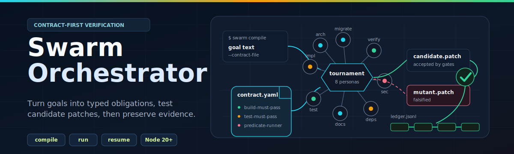

<div align="center">



# Swarm Orchestrator

A CLI for auditing AI-generated PRs and grading patches against typed contracts.

[](https://github.com/moonrunnerkc/swarm-orchestrator/actions/workflows/ci.yml)
[](LICENSE)
[](package.json)
[](package.json)
[](benchmarks/real-corpus/scores/latest.json)

<a href="#install"><b>Install</b></a> ·
<a href="#quick-start"><b>Quick start</b></a> ·
<a href="#what-this-does"><b>What it does</b></a> ·
<a href="#real-corpus-headline-f1"><b>Headline F1</b></a> ·
<a href="#cheat-detectors"><b>Detectors</b></a> ·
<a href="#ai-bom"><b>AI-BOM</b></a> ·
<a href="#reference"><b>Reference</b></a>

</div>

---

<div align="center">

## What This Does

Reads a pull-request diff, scores it against four advisory-grade cheat detectors, and writes a suspicion-score comment plus a CycloneDX-ML / SPDX 3.0 AI-Profile artifact.
Default mode is `--mode=advise` (signal only); `--mode=gate` opts into the merge-blocking exit-code contract.
The compliance side (AIBOM, hash-chained evidence ledger, EU AI Act Annex IV / CISA SBOM-for-AI mappings) is the credible-procurement angle; the detector accuracy is the work in progress.

</div>

## Install

```bash
git clone https://github.com/moonrunnerkc/swarm-orchestrator.git
cd swarm-orchestrator
npm install
npm run build
npm link
swarm --help
```

Node 20 or later. See [`package.json`](package.json).

## Quick start

```bash
# audit a PR by reference (advisory by default; never blocks the merge)
GITHUB_TOKEN=... swarm audit moonrunnerkc/swarm-orchestrator#42

# opt in to merge-blocking gate mode
GITHUB_TOKEN=... swarm audit moonrunnerkc/swarm-orchestrator#42 --mode gate

# audit a local diff with the experimental detector set (all 10 detectors)
git diff main...HEAD | swarm audit --diff-stdin --detectors experimental

# audit + emit a CycloneDX 1.6 ML-BOM
swarm audit --diff-file my.patch --emit-aibom cyclonedx-ml

# shadow-mode dogfood: record verdicts to disk, no comment, no gate
swarm audit --pr <ref> --shadow my-org/my-repo

# single-file shadow output (one JSON per audit invocation; see docs/shadow-mode.md)
swarm audit --pr <ref> --shadow-output ./audit-verdict.json
```

Exit codes: `0` advisory-clean or any advise-mode run, `1` block (gate mode only), `2` usage error.

## Real-corpus headline F1

The headline number is the score against the AI-labeled real-corpus
baseline (205 PRs, 10 broken / 195 clean, eight agent vendors). Reproduce
with `node dist/scripts/corpus/score-real.js`; snapshot at
[`benchmarks/real-corpus/scores/latest.json`](benchmarks/real-corpus/scores/latest.json).
Public dashboard: [moonrunnerkc.github.io/swarm-orchestrator](https://moonrunnerkc.github.io/swarm-orchestrator/docs/leaderboard/).

| | Value |
|---|---|
| **Real-corpus F1 (deterministic)** | **0.140** |
| Real-corpus precision (deterministic) | 0.091 |
| Real-corpus recall (deterministic) | 0.300 |
| Advisory findings on the 195 clean PRs | 145 (down from ~1146 before the v10.4 verification stage) |
| Real-corpus precision (judge gate on) | 1.000 (the gate refuses to block anything it cannot confirm) |
| Sample size | 205 AI-labeled PRs (10 broken, 195 clean), pending human re-label under labels-v2 |
| Agent vendors covered | 8 (devin, cursor, openhands, copilot-workspace, claude-code, aider, codex-cli, replit-agent) |
| Detector set scored | experimental (all 10), so retired detectors are still measured |
| LLM judge | off by default; rerun with `SWARM_AUDIT_LLM_JUDGE=1` (or `--judge`) to score the gated path |

The recall fell from the v10.1 number (0.500) because two of the prior
"catches" were `actions/checkout@v6` version-ceiling blocks on PRs that
upgrade a real action, which v10.4 stops treating as hallucinations.
Removing a catch that was only ever a coincidence is a correctness fix,
not a regression. The reliable, label-independent win is on the 195
clean PRs, where the verification stage cut non-informational findings
by 87% (`docs/posts/2026-05-27-wild-pr-scan.md` has the per-detector
breakdown).

Findings reach a reviewer through two stages after the detectors run.
First a deterministic verification stage refutes a candidate when the
diff itself shows the pattern is legitimate (a mock target that resolves
to an internal directory in the same diff, a rename paired with several
different names, a test removed alongside the source it covered, a
"no test" finding on a PR that claims no fix). Then, when
`--mode=gate` and the judge are on, the Haiku confirmation gate must
confirm a finding before it is allowed to block; anything it cannot
confirm drops to advisory. On this corpus the gate refutes every
candidate block, which is why judged precision is 1.000 and judged
recall is 0: against AI-generated labels the safe gate blocks nothing
rather than block wrongly. Trustworthy block-recall waits on the
human-labeled corpus (`benchmarks/real-corpus/labels-v2/`).

The synthetic regression suite prints F1 1.000 on the same code. **That
1.000 is a self-consistency check, not detection power**: the generator
and the detectors share the same regex vocabulary, so a perfect score on
generated patches is what "the detector still understands its own
generator" looks like, nothing more. The synthetic number is preserved
in the leaderboard as a regression sidebar
([`benchmarks/leaderboard/results.json`](benchmarks/leaderboard/results.json)),
not as the headline.

The 205-entry corpus is labeled by an AI judge with "pending human
review" stamped on every entry. That is the largest single hole in the
project's credibility today; closing it is the next milestone (see
[`docs/labeling-methodology.md`](docs/labeling-methodology.md) and the
labels-v2 scaffold under [`benchmarks/real-corpus/labels-v2/`](benchmarks/real-corpus/labels-v2/)).

**Per-detector breakdown** (intent layer active, default strict policy,
experimental set, judge off):

| Detector | Version | TP | FP | FN | Precision | Gate status |
|---|---|---|---|---|---|---|
| `error-swallow` | 2.0.0 | 3 | 13 | 0 | **0.188** | advisory |
| `mock-of-hallucination` | 2.0.0 | 0 | 3 | 2 | 0.000 | advisory |
| `no-op-fix` | 2.0.0 | 0 | 9 | 5 | 0.000 | advisory |
| `fake-refactor` | 2.0.0 | 0 | 2 | 0 | 0.000 | advisory |
| `assertion-strip` | 1.0.0 | 0 | 5 | 0 | 0.000 | advisory |
| `coverage-erosion` | 1.1.0 | 0 | 4 | 0 | 0.000 | advisory |
| `test-relaxation` | 1.1.0 | 0 | 4 | 0 | 0.000 | advisory |
| `comment-only-fix` | 1.0.0 | 0 | 0 | 5 | n/a | advisory |
| `exception-rethrow-lost-context` | 1.0.0 | 0 | 0 | 0 | n/a | unmeasured |
| `dead-branch-insertion` | 1.0.0 | 0 | 0 | 0 | n/a | unmeasured |

A detector is gate-eligible (allowed to emit a blocking finding without
the judge) only when its measured precision is at least 0.90, it has at
least 5 true positives, and the Wilson 95% lower bound is at least 0.50.
No detector clears that bar on the current corpus, so every one is
advisory: it still runs and still surfaces findings, capped to advisory
severity. The gate governs blocking only, so recall is unchanged and
nothing is silenced. The tier is computed from the scores snapshot into
[`benchmarks/real-corpus/promotions.json`](benchmarks/real-corpus/promotions.json),
and CI fails if the committed policy drifts from a fresh recompute
(`npm run promotions:check`), so a detector cannot be hand-promoted into
the gate without the precision to back it.

Every PR-comment finding renders its confidence and its measured
precision inline, so a reviewer sees both every time a finding fires.
The badge data source is
[`src/audit/report-comment/detector-precision.ts`](src/audit/report-comment/detector-precision.ts).

## Cheat detectors

Ten detectors. Seven load by default; three (`comment-only-fix`,
`exception-rethrow-lost-context`, `dead-branch-insertion`) require
`--detectors experimental` because they have never fired on real PR
data, so there is no signal to gauge them against. The set governs which
detectors load; the precision gate above governs which may block.
Registered in
[`src/audit/cheat-detector/detector-sets.ts`](src/audit/cheat-detector/detector-sets.ts).

| Category | Set | Trigger |
|---|---|---|
| `error-swallow` | default | Bare empty or comment-only `catch` block added in non-test code. |
| `mock-of-hallucination` | default | `jest.mock` / `vi.mock` / `@patch` against a module declared in no manifest in the repo. |
| `no-op-fix` | default | Test modified with no source change in the same PR, or vice versa; import-graph reachability fallback when only one side moved. |
| `fake-refactor` | default | Exported symbol renamed in source, no caller in the diff updates the old name. |
| `assertion-strip` | experimental | Net assertion count in a test file drops after the PR. |
| `coverage-erosion` | experimental | Source branch added with no compensating test addition. |
| `test-relaxation` | experimental | Strict matcher swapped for a loose one, or a test block removed without same-chunk replacement. |
| `comment-only-fix` | experimental | Source modifications are all comment additions. |
| `exception-rethrow-lost-context` | experimental | `throw err` replaced with `throw new Error(...)` and `{ cause }` not forwarded. |
| `dead-branch-insertion` | experimental | Branch guarded by a literal-false condition added. |

Each detector lives in its own file under [`src/audit/cheat-detector/`](src/audit/cheat-detector/).

Per-repo configuration in `.swarm/audit-config.yaml`: `excludePaths` exempts
globs from detection, `intentSeverityPolicy` (`strict` | `lenient` | `off`)
controls the PR-intent severity-upgrade layer. See
[`docs/audit-config.md`](docs/audit-config.md).

## Use as a GitHub Action

```yaml
name: PR audit
on:
  pull_request:
    types: [opened, synchronize, reopened, ready_for_review]
permissions:
  pull-requests: write
  contents: read
jobs:
  audit:
    runs-on: ubuntu-latest
    steps:
      - uses: actions/checkout@v4
        with:
          fetch-depth: 0
      - uses: moonrunnerkc/swarm-orchestrator@main
        with:
          audit-mode: true
          mode: advise           # advise | gate
          detectors: default     # default | experimental
          emit-aibom: cyclonedx-ml
        env:
          GITHUB_TOKEN: ${{ secrets.GITHUB_TOKEN }}
```

Outputs: `audit-pass`, `audit-findings`, `audit-ledger`. Full input list in [`action.yml`](action.yml).

## AI-BOM

`--emit-aibom cyclonedx-ml | spdx-ai | both` writes one document per format per run under `.swarm/aibom/`. Emitters in [`src/audit/aibom/`](src/audit/aibom/) produce hand-rolled JSON against the upstream specs; no third-party AI-BOM runtime dep.

Procurement mappings:

- [`docs/eu-ai-act-mapping.md`](docs/eu-ai-act-mapping.md): EU AI Act Article 11 + Annex IV fields.
- [`docs/cisa-sbom-ai-mapping.md`](docs/cisa-sbom-ai-mapping.md): CISA SBOM-for-AI minimum elements.

## Orchestrator mode

Use this when you want Swarm to grade patches against a typed contract instead of auditing a PR diff.

```bash
swarm init                                    # scaffold contract.yaml + patches.jsonl
swarm run --goal "check this project builds"  # deterministic provider, no API key
```

Minimal contract:

```yaml
obligations:
  - type: build-must-pass
    command: npm run build
  - type: test-must-pass
    command: npm test
```

Hosted-model run:

```bash
export ANTHROPIC_API_KEY=sk-...
swarm run --goal "add a /health endpoint" --extractor anthropic --session anthropic
```

Local-LLM run (Ollama):

```bash
swarm run --goal "add a named export sum(a, b)" \
  --session local --local-backend ollama \
  --local-base-url http://localhost:11434 \
  --local-model-session gemma4:31b \
  --local-grammar none --local-max-concurrency 1 --preset fast
```

Provider details in [`docs/providers.md`](docs/providers.md). Obligation taxonomy in [`docs/check-types.md`](docs/check-types.md). Schema in [`src/contract/schema/v1.json`](src/contract/schema/v1.json).

## Architecture

Two CLI surfaces share one core.

`swarm run` drives the v8 pipeline (extractor, session, predicate-runner, falsifier, verifier). No patch reaches `main` without passing both `verifyObligation` and `postMergeVerify`.

`swarm audit` reuses the verifier and falsifier layers against a unified diff. It needs no session, no extractor, and no model credentials.

Both surfaces write to the same append-only hash-chained ledger ([`src/ledger/ledger.ts`](src/ledger/ledger.ts)). Tampering breaks the chain.

## Commands

| Command | Purpose |
|---|---|
| `swarm audit <ref \| --diff-*>` | Audit a PR or local diff. Advisory by default. |
| `swarm run --goal "<text>"` | Compile and grade in one step. |
| `swarm compile <goal>` | Write a reusable compiled contract directory. |
| `swarm run <contract-dir>` | Grade against a pre-compiled contract directory. |
| `swarm resume <run-id>` | Resume a killed run from its ledger. |
| `swarm stats <run-id>` | Aggregate diagnostic counts from a run ledger. |
| `swarm init` | Scaffold `contract.yaml` and `patches.jsonl`. |
| `swarm doctor [--fix] [--connectors]` | Probe local prerequisites. |

`swarm <cmd> --help` for the flag list of any subcommand.

## Run artifacts

```text
.swarm/contracts/<id>/contract.jsonl   compiled contract (orchestrator mode)
.swarm/ledger/<run-id>.jsonl           orchestrator ledger
.swarm/ledger/audit-<run-id>.jsonl     audit ledger
.swarm/aibom/<run-id>.cdx.json         CycloneDX-ML (when --emit-aibom)
.swarm/aibom/<run-id>.spdx.json        SPDX 3.0 AI-Profile (when --emit-aibom)
.swarm/shadow/<repo>/<run-id>.json     shadow-mode verdict (when --shadow)
```

`.swarm/` is in [`.gitignore`](.gitignore) at the consumer-repo level.

## Integrations

- Claude Code slash command: [`.claude/commands/swarm-audit.md`](.claude/commands/swarm-audit.md).
- Cursor rule pack: [`integrations/cursor/swarm-audit.mdc`](integrations/cursor/swarm-audit.mdc).
- Aider pre-commit hook: [`integrations/aider/pre-commit-swarm-audit`](integrations/aider/pre-commit-swarm-audit).

## Versions

`10.3.0-advisory` finishes the four solo-doable items left after
`10.2.0-advisory`. `no-op-fix` bumps to 2.0.0 with a gated Anthropic
Haiku judge (off by default; opt in with `--enable-llm-judge` or
`SWARM_AUDIT_LLM_JUDGE=1`), content-addressed cache at
`.swarm/llm-judge-cache/`, and a new `llm-judge-result` ledger entry
that pins the model id so replay is deterministic. The real-corpus
baseline is re-scored against the v2.0 detectors: overall F1 0.167
(P 0.100, R 0.500), with `mock-of-hallucination` picking up 2 TPs the
v1.x shape missed. A static dashboard fetches the score snapshot
directly and publishes via GitHub Pages
([moonrunnerkc.github.io/swarm-orchestrator](https://moonrunnerkc.github.io/swarm-orchestrator/docs/leaderboard/)).
`--shadow-output <path>` writes one JSON object per audit with
detector verdicts, judge invocation count, and the rendered comment;
the existing `--shadow <repo-label>` per-repo rollup remains. No
detector crosses the F1 0.5 promotion gate, so all ten stay
advisory-only.

`10.2.0-advisory` repositions the project around the suspicion-score
verdict the measured precision can credibly support. Synthetic 1.000 is
demoted to a regression-only number; the real-corpus 0.109 F1 is the
only headline. `--mode advise|gate` makes the gate behavior opt-in. Six
detectors retire to `--detectors experimental`. Every PR-comment finding
renders its measured-precision badge inline. Shadow-mode infrastructure
lands under `.swarm/shadow/`. Labeling methodology, kappa script, and
labels-v2 scaffold ship alongside; the actual human labels are the next
milestone.

`10.1.0` raised detector accuracy on real PRs: the 205-entry hand-labeled
baseline replaces the synthetic 500-case number as the published
headline, the PR-intent layer escalates findings when the agent claims a
fix, and five new manifest readers landed on `mock-of-hallucination`.

`10.0.0` added the audit surface, the cheat detectors, the AI-BOM
emitters, and the corpus. `9.x` removed the v6 verified-branch pipeline;
pin `8.0.x` if you still need `swarm run --v6`.

## Reference

- [`action.yml`](action.yml): GitHub Action inputs and outputs.
- [`src/contract/schema/v1.json`](src/contract/schema/v1.json): contract schema.
- [`src/audit/cheat-detector/`](src/audit/cheat-detector/): detector registry.
- [`src/audit/cheat-detector/detector-sets.ts`](src/audit/cheat-detector/detector-sets.ts): default vs. experimental selection.
- [`src/audit/report-comment/detector-precision.ts`](src/audit/report-comment/detector-precision.ts): measured-precision table.
- [`src/audit/aibom/`](src/audit/aibom/): AI-BOM emitters.
- [`benchmarks/falsification-corpus/v10-synthetic-corpus/`](benchmarks/falsification-corpus/v10-synthetic-corpus/): synthetic regression corpus.
- [`benchmarks/real-corpus/`](benchmarks/real-corpus/): real-corpus baseline + labels.
- [`docs/labeling-methodology.md`](docs/labeling-methodology.md): labels-v2 rubric and kappa policy.
- [`benchmarks/leaderboard/`](benchmarks/leaderboard/): reproducible scorer.
- [`docs/shadow-mode.md`](docs/shadow-mode.md): single-file and per-repo shadow audit guide.
- [`docs/`](docs/): provider, check-type, AI-BOM, and adapter docs.
- [`CHANGELOG.md`](CHANGELOG.md): release history.
- [`CONTRIBUTING.md`](CONTRIBUTING.md): development workflow.
- [`SECURITY.md`](SECURITY.md): vulnerability reporting.
- [`CLAUDE.md`](CLAUDE.md): maintainer architecture notes.

## Contributing

```bash
npm install
npm run build
npm test
npm run typecheck
npm run lint
npm run leaderboard
```

Project conventions in [`CLAUDE.md`](CLAUDE.md). Security disclosures via [`SECURITY.md`](SECURITY.md) (never via public issues).

## License

[ISC](LICENSE).

## Privacy

This Action contacts Chainguard's licensing server to verify authorization. Connection metadata (IP address, GitHub repository identifier, timestamp, and any metadata encoded in the auth token) is transmitted to Chainguard, Inc. even if authorization is denied in accordance with our [Privacy Notice](https://www.chainguard.dev/legal/privacy-notice)
